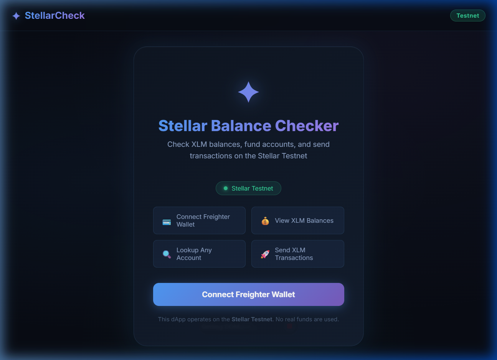

# ✦ StellarCheck – Wallet Balance Checker

A **Stellar Testnet dApp** for checking XLM balances, looking up any account, funding wallets via Friendbot, and sending XLM transactions — all built with React, TypeScript, and the Stellar SDK.

> **Level 1 – White Belt Submission** | Stellar Frontend Challenge

---

## 📸 Screenshots

### Wallet Connected State


### Balance Displayed


---

## 🚀 Features

| Feature | Description |
|---|---|
| 🔌 **Wallet Connect** | Connect / Disconnect Freighter wallet |
| 💰 **Balance Display** | Real-time XLM & token balances from Horizon |
| 🔍 **Account Lookup** | Check any Stellar testnet public key |
| 💧 **Friendbot Fund** | Fund new accounts with 10,000 testnet XLM |
| 🚀 **Send XLM** | Send XLM on Testnet with Freighter signing |
| ✅ **Tx Feedback** | Success hash + link to Stellar Expert explorer |
| 🔄 **Auto-Refresh** | Balance auto-refreshes every 30 seconds |

---

## 🛠️ Tech Stack

- **Frontend**: React 18 + TypeScript + Vite
- **Stellar SDK**: `@stellar/stellar-sdk` (Horizon API)
- **Wallet**: `@stellar/freighter-api` (Freighter browser extension)
- **Network**: Stellar Testnet (`https://horizon-testnet.stellar.org`)
- **Styling**: Vanilla CSS with glassmorphism dark theme

---

## 📋 Prerequisites

Before running this project, you need:

1. **Node.js** v18 or later — [Download from nodejs.org](https://nodejs.org)
2. **Freighter Wallet** browser extension — [Install from freighter.app](https://freighter.app)

---

## ⚙️ Setup Instructions

### 1. Clone the Repository

```bash
git clone https://github.com/AyushPal0/stellar-balance-checker.git
cd stellar-balance-checker
```

### 2. Install Dependencies

```bash
npm install
```

### 3. Start the Development Server

```bash
npm run dev
```

Open your browser and navigate to: **http://localhost:5173**

### 4. Configure Freighter for Testnet

1. Click the Freighter extension icon in your browser
2. Go to **Settings → Network**
3. Select **Testnet**
4. Create or import a wallet

### 5. Fund Your Testnet Account

Since this is the Testnet, your new account needs to be funded:

- Click **"Fund with Friendbot"** in the app, OR
- Visit https://friendbot.stellar.org and paste your public key

---

## 🏗️ Project Architecture

```
balance check/
├── index.html                    # HTML entry with SEO meta tags
├── vite.config.ts                # Vite + Node.js polyfills config
├── tsconfig.json                 # TypeScript configuration
├── package.json
└── src/
    ├── main.tsx                  # React app entry point
    ├── App.tsx                   # Root component + layout
    ├── App.css                   # All styles (dark theme)
    ├── index.css                 # Global reset
    ├── types/
    │   └── stellar.ts            # TypeScript type definitions
    ├── lib/
    │   └── stellar.ts            # Stellar SDK utilities (balance, tx, etc.)
    ├── context/
    │   └── WalletContext.tsx     # React Context for wallet state
    └── components/
        ├── ConnectScreen.tsx     # Landing / wallet connect page
        ├── WalletDashboard.tsx   # Main dashboard (balance + actions)
        ├── BalanceLookup.tsx     # Look up any account's balance
        └── Modals.tsx            # Send XLM + Fund Account modals
```

---

## 🧩 How It Works

### Wallet Connection Flow

```
ConnectScreen → requestAccess() [Freighter] → getPublicKey()
→ fetchAccountInfo() [Horizon API] → WalletDashboard
```

### Send Transaction Flow

```
User fills form → buildTransaction() [stellar-sdk]
→ signTransaction() [Freighter]
→ server.submitTransaction() [Horizon]
→ Show hash + Stellar Expert link
```

### Balance Fetch

```
loadAccount(publicKey) → account.balances[]
→ Filter native (XLM) or tokens → Display in UI
```

---

## 📦 Available Scripts

| Command | Description |
|---|---|
| `npm run dev` | Start development server |
| `npm run build` | Build for production |
| `npm run preview` | Preview production build |
| `npm run lint` | Run ESLint |

---

## 🌐 Deployment

### Deploy to Vercel (Recommended)

```bash
npm run build
npx vercel --prod
```

### Deploy to Netlify

```bash
npm run build
# Upload the dist/ folder to Netlify
```

---

## ⚠️ Important Notes

- This dApp works **only on Stellar Testnet** — no real funds are used
- You must have the **Freighter** browser extension installed to connect your wallet
- Freighter may require the page to be served over **HTTPS** in production
- Testnet accounts must be **funded** before they appear on the network

---

## 📚 Resources

- [Stellar Developer Docs](https://developers.stellar.org)
- [Stellar JS SDK](https://developers.stellar.org/docs/tools/sdks/library#javascript-sdk)
- [Freighter API Docs](https://docs.freighter.app)
- [Stellar Expert Explorer (Testnet)](https://stellar.expert/explorer/testnet)
- [Horizon Testnet API](https://horizon-testnet.stellar.org)

---

## 📄 License

MIT License — feel free to use and modify.
